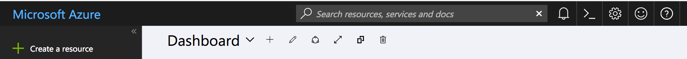
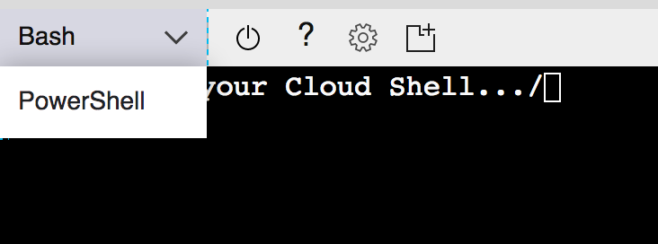
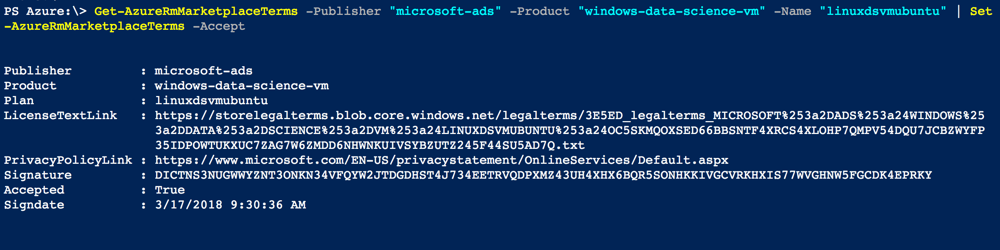

# manage deep learning VM with GPU on Azure ☁️

<!-- TOC depthFrom:2 -->

- [Installation 📦](#installation-)
    - [Prerequisites 🛠](#prerequisites-🛠)
    - [Sign the terms of service ⚖️](#sign-the-terms-of-service-)
    - [Initialize Terraform 🌏](#initialize-terraform-)
- [Configuration ⚙️](#configuration-)
- [Usage 📖](#usage-)
    - [Create or **permanently** delete the Virtual Machine 🆙 🚫](#create-or-permanently-delete-the-virtual-machine--)
    - [Work with the machine 👩‍💻](#work-with-the-machine-‍)
- [Install cuDNN](#install-cudnn)

<!-- /TOC -->

## Installation 📦

First download the content of this repository into the project folder from where you want to manage the VM.

```sh
# download the file and unzip in current directory (under vm-automation)
curl -s https://codeload.github.com/ecohydro/vm-automation/legacy.tar.gz/master | tar -xz --one-top-level=terraform --exclude "assets" --strip-components=1
# link the Makefile into the working directory
ln -s terraform/Makefile Makefile
```

Your project should look something like this if you started your project using the [cookiecutter data science template](https://drivendata.github.io/cookiecutter-data-science/). Delete the existing Makefile from that template if you are using it so that it doesn't conflict with the Makefile for Azure:

```
├── README.md          <- The top-level README for developers using this project.
├── data
│   ├── external       <- Data from third party sources.
│   ├── interim        <- Intermediate data that has been transformed.
│   ├── processed      <- The final, canonical data sets for modeling.
│   └── raw            <- The original, immutable data dump.
│
├── models             <- Trained and serialized models, model predictions, or model summaries
│
├── notebooks          <- Jupyter notebooks. Naming convention is a number (for ordering),
│                         the creator's initials, and a short `-` delimited description, e.g.
│                         `1.0-jqp-initial-data-exploration`.
│
├── references         <- Data dictionaries, manuals, and all other explanatory materials.
│
├── reports            <- Generated analysis as HTML, PDF, LaTeX, etc.
│   └── figures        <- Generated graphics and figures to be used in reporting
│
├── requirements.txt   <- The requirements file for reproducing the analysis environment, e.g.
│                         generated with `pip freeze > requirements.txt`. Can also be a conda 
                            environment file if you make minor edit to setup.py
│
├── setup.py           <- Make this project pip installable with `pip install -e`
├── src                <- Source code for use in this project.
│   ├── __init__.py    <- Makes src a Python module
│   │
│   ├── data           <- Scripts to download or generate data
│   │   └── make_dataset.py
│   │
│   ├── features       <- Scripts to turn raw data into features for modeling
│   │   └── build_features.py
│   │
│   ├── models         <- Scripts to train models and then use trained models to make
│   │   │                 predictions
│   │   ├── predict_model.py
│   │   └── train_model.py
│   │
│   └── visualization  <- Scripts to create exploratory and results oriented visualizations
│       └── visualize.py
|
├── terraform               <- You just downloaded and extracted this from this repo. Cointains your infrastructure plan.
    ├── azure_dsvm.tf       <- Terraform script that defines what should be built on Azure and how it all fits together
    ├── config.auto.tfvars  <- Terraform variables that control location, access, type, and name of your VM. Open and edit
    ├── Makefile            <- Defines the make commands you can use as shortcuts to interact with the VM: stop, start, ssh,
                               etc. Only run make commands from the project directory, not the terraform directory.
    └── readme.md
```


### Prerequisites 🛠

First make sure you have some prerequisites installed:

- [ ] [Terraform](https://www.terraform.io/downloads.html) for infrastructure provisioning, place this in `/usr/local/bin` on Mac or Linux and your terminal should find the binary automatically. Test by running `terraform` to see if a help page appears
- [ ] [azure cli 2.0](https://docs.microsoft.com/en-us/cli/azure/install-azure-cli?view=azure-cli-latest) as provider for terraform and to interact with the VM. Install with brew, yum, or apt-get depending on your OS
- [ ] [make](http://gnuwin32.sourceforge.net/packages/make.htm) as simple cross-platform scripting solution. You have this if you are on Mac or Linux.

### Sign the terms of service ⚖️ (if you are using our WAVES lab account, this step has already been done for you)

The Data Science VM on Azure is offered via the Marketplace and therefore has specific terms of service. Before this offering can be automatically deployed via Terraform you need to accept the license agreement for your subscription. This can be done via **PowerShell**. Easiest way to use powershell is open the Cloudshell on the [Azure Portal](http://portal.azure.com)

<br>
_Open the Cloudshell by clicking the `>_` icon in the top right_

<br>
_Once open select `PowerShell` as environment_

```powershell
# Use this command to view the current license agreement
Get-AzureRmMarketplaceTerms -Publisher "microsoft-ads" -Product "linux-data-science-vm-ubuntu" -Name "linuxdsvmubuntu"

# If you feel confident to agree to the agreement use the following command to enable the offering for your subscription
Get-AzureRmMarketplaceTerms -Publisher "microsoft-ads" -Product "linux-data-science-vm-ubuntu" -Name "linuxdsvmubuntu" | Set-AzureRmMarketplaceTerms -Accept
```
<br>
_Final output should look like this_

### Initialize Terraform 🌏

Before you can use the Terraform recipe you need to be in the `terraform` directory and initialize it by running

```sh
terraform init
```

## Configuration ⚙️

To customize the VM deployment you should edit the `config.auto.tfvars` file in this directory. The only mandatory variable you need to provide is `admin_key` which should be a publich SSH key that will be used to connect to the Virtual Machine. See [this explanation](https://help.github.com/articles/generating-a-new-ssh-key-and-adding-it-to-the-ssh-agent/) on how to create a SSH Key pair if you do not have one.

Just uncomment the variables you want to overwrite. If you want to customize other things feel free to [submit an issue](https://github.com/anoff/vm-automation/issues/new) or look into the way [variables work in terraform](https://www.terraform.io/docs/configuration/variables.html).

## Usage 📖

### Create or **permanently** delete the Virtual Machine 🆙 🚫

```sh
# create a new data scientist VM on a GPU machine
terraform apply

# kill the entire VM
terraform destroy -force
```

When running the terraform command, two new files will be created. `.vm-id` will hold the unique Azure Resource ID of the VM that is used to start/stop it as well as `.vm-ip` that is the public IP address of the VM. The IP is static which means it will not change if you start/stop the machine. 

> Note: When stopping the VM either use `make stop` or `az vm deallocate`. `az vm stop` wil **NOT** deallocate the machine, that means you still have to pay for the compute resources.

### Work with the machine 👩‍💻

```sh
# link the Makefile to your main directory and then run the following commands

make start # to start the VM

make stop # to deallocate it (no more costs for the compute resource)

make ssh # SSH into the machine and port forward 8888 so you can just run 'jupyter notebook' on the VM and open it on your local machine

make syncup # copy your local directory to the VM

make syncdown # copy any changes you made on the remote system over to your local directory 🚨 WARNING: OVERWRITES LOCAL CHANGES
```

